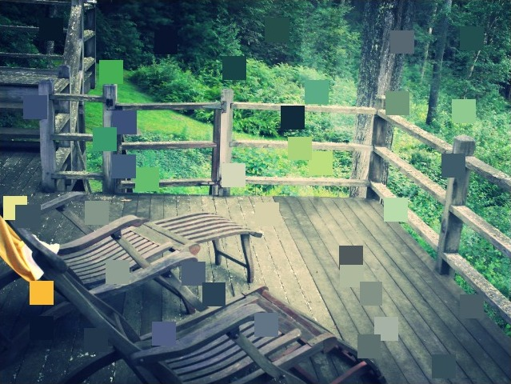

# Little Data

## Authors
- Ruben Martinez, rmartinez93

## Description
Color data processed from a computer's camera are randomly sampled, processed, and output as a pitch in real-time. Different colors sound differently, allowing you to listen to the colors of the world around you. Color-to-sound mapping has long been a personal interest of mine due my color-blindness. While this experiment does not provide a one-to-one mapping of colors and pitches (though I’m working on a project that does just that), it serves more as a way to show just how musical the world around us can be. I added controls so the user in control can change the various factors in the algorithm, and included a few preset options that I felt best illustrated the beauty of listening to what we see.

## Link to Prototype
[Live Version of 'Little Data'](http://www.rmartinez.co/DATA "Live Version of 'Little Data'")

## Example Grabbing Color Data, Outputing Pitch
```
x = Math.floor(Math.random()*canvas.clientWidth);
y = Math.floor(Math.random()*canvas.clientHeight);

data = ctx.getImageData(x, y, 1, 1).data;

var RGB = data[0]+data[1]+data[2];
var HSV = rgbToHsv(data[0], data[1], data[2]);

if(HSV[2] > 20) { // High Pass Filter (blocks dark colors)
    var now = context.currentTime;
    oscillator.frequency.setValueAtTime(HSV[0]*scale, now);
    amp.gain.cancelScheduledValues(now);
    amp.gain.setValueAtTime(amp.gain.value, now);
    amp.gain.linearRampToValueAtTime(0.5, context.currentTime + 0.1);
}
```
## Links to External Libraries
[RGB to HSV Conversion](https://gist.github.com/mjijackson/5311256 "RGB to HSV Conversion")

## Images & Videos

