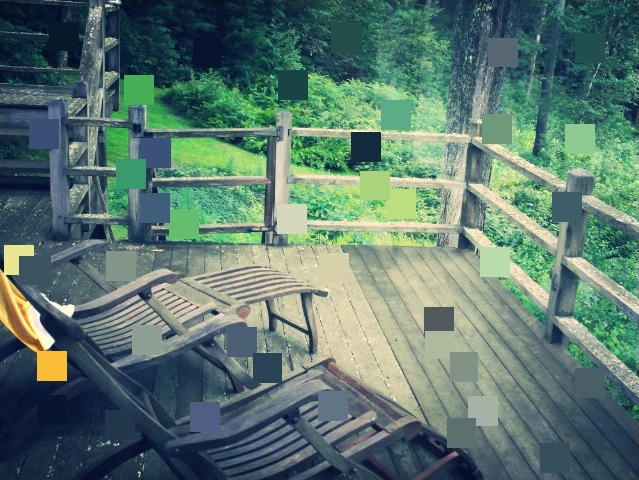

# Little Data

## Authors
- Ruben Martinez, Github: rmartinez93

## Description
Color data processed from a computer's camera are randomly sampled, processed, and output as a pitch in real-time. Different colors sound differently, allowing you to listen to the colors of the world around you. Color-to-sound mapping has long been a personal interest of mine due my color-blindness. While this experiment does not provide a one-to-one mapping of colors and pitches (though I’m working on expanding it to do just that), it serves as a way to show just how musical and full of color the world around us can be. Controls allow the user to be in control and change various factors in the conversion algorithm, and I've included a few preset options that I feel best illustrate the beauty of listening to what we see.

## Link to Prototype
[Download from Chrome Web Store](https://chrome.google.com/webstore/detail/little-data-a-web-art-exp/clgkogdimfofiapppjnpbkpkanghiabh "Download from Chrome Web Store")
 
[See in Chrome Browser](http://rmartinez.co/DATA "See in Chrome Browser")

## Example Grabbing Color Data, Outputing Pitch
```
x = Math.floor(Math.random()*canvas.clientWidth);
y = Math.floor(Math.random()*canvas.clientHeight);

data = ctx.getImageData(x, y, 1, 1).data;

var HSL = rgbToHsl(data[0], data[1], data[2]);

var height   = Math.pow(2, Math.floor(scale+(HSL[2]/20))); //height range, from C-(scale) to C-(scale+5), based on lightness
var end      = Math.pow(2, Math.floor(scale+(HSL[2]/20))+1); //end of chosen scale
var pitch    = height+(((end-height)/360)*HSL[0]); //find pitch in our scale range, based on hue
var loudness = HSL[1]*5; //TODO: find loudness, based on saturation

var now = context.currentTime;
oscillator.frequency.setValueAtTime(pitch, now);
amp.gain.cancelScheduledValues(now);
amp.gain.setValueAtTime(amp.gain.value, now);
amp.gain.linearRampToValueAtTime(0.5, context.currentTime + 0.1);
```
## Links to External Libraries
[RGB to HSV Conversion](https://gist.github.com/mjijackson/5311256 "RGB to HSV Conversion")
[Chromeless Chrome App](http://sondreb.com/blog/post/chromeless-chrome-app.aspx "Chromeless Chrome App")
[Ionicons](https://github.com/driftyco/ionicons "Ionicons Framework")
## Images & Videos

